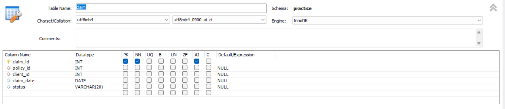
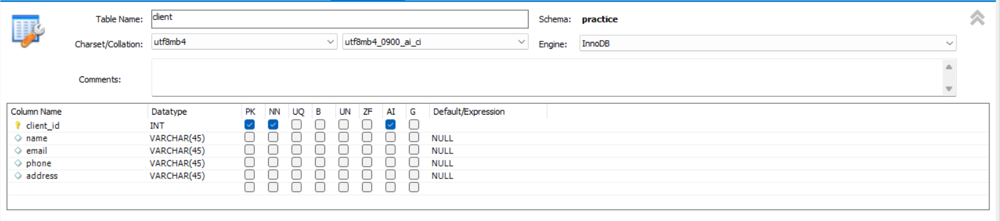
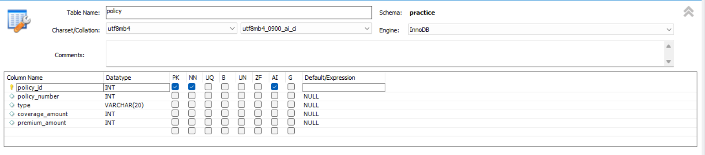
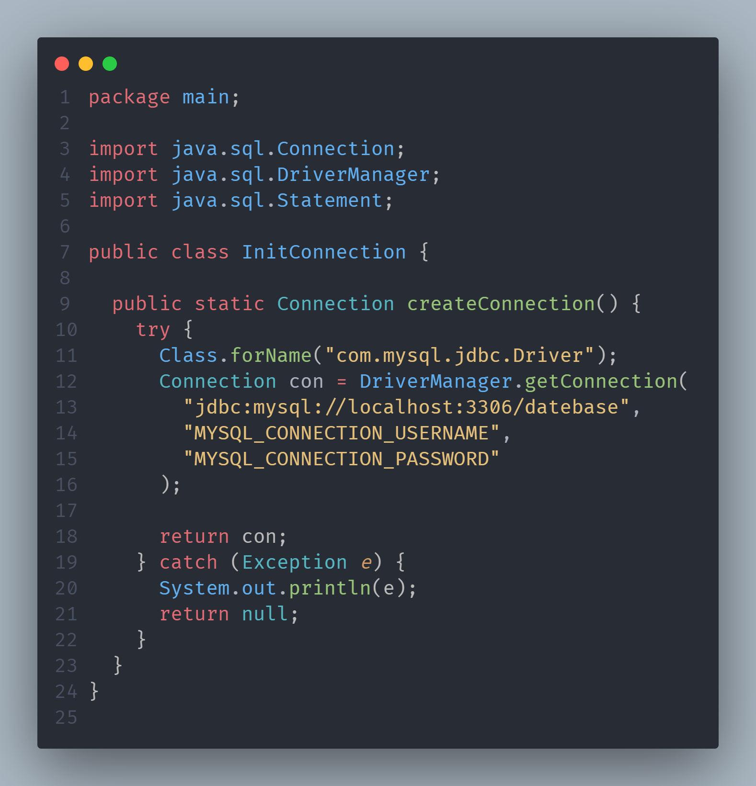

# Insurance Agency Management System

This is a Java-based application designed to manage insurance policies, clients, claims, and other related data. The application uses JDBC for database connectivity and MySQL as the backend database.

## Features

- Manage client information
- Policy management
- Claim processing

## Prerequisites

Before you begin, ensure you have the following installed:

- Java Development Kit (JDK) 17 or higher
- MySQL Server
- MySQL JDBC Driver
- Eclipse IDE
- Command line for running Java applications

## Setup and Installation

### 1. Clone the Repository

```bash
git clone https://github.com/saad2786/Case_Study_98.git

```
## Create Databse and Tables on Mysql workbench
- Create following three table (policy, client, claim)
  




## Set configurations
- In src\main\InitConnection.java
- Replace 'MYSQL_CONNECTION_USERNAME' with your local mysql server connection username
- Replace  'MYSQL_CONNECTION_PASSWORD' with your local mysql server connection password



## Run Java Application

